# Patterns of Enterprise Application Architecture
Compilation of sample code from the book Patterns of Enterprise Application Architecture by Martin Fowler.

I used and created this repo when I studied the book. Super worth reading it! 

Read the book and learn more on each topic.

Enjoy! :)

## Layering
- Presentation
- Domain Logic
- Data Source

## Patterns
[Domain Logic Patterns](#DomainLogicPatterns)
- Transaction Script
- Domain Model
- Table Module
- Service Layer

[Data Source Patterns](#DataSourcePatterns)
- Table Data Gateway
- Row Data Gateway
- Active Records
- Data Mapper

[Object-Relational Behavior Patterns](#ObjectRelationalBehaviorPatterns)
- Unit of Work
- Identify Map
- Lazy Load

[Object-Relational Structural Patterns](#ObjectRelationalStructuralPatterns)
- Identity Field
- Foreign Key Mapping
- Association Table Mapping
- Dependent Mapping
- Embedded Value
- Serialized LOB
- Single Table Inheritance
- Class Table Inheritance
- Concrete Table Inheritance
- Inheritance Mappers

[Object-Relational Metadata Mapping Patterns](#ObjectRelationalMetadataMappingPatterns)
- Metadata Mapping
- Query Object
- Repository

[Web Presentation Patterns](#WebPresentationPatterns)
- Model View Controller
- Page Controller
- Front Controller
- Template View
- Transform View
- Two Step View
- Application Controller

[Distribution Patterns](#DistributionPatterns)
- Remote Facade
- Data Transfer Object

[Offline Concurrency Patterns](#OfflineConcurrencyPatterns)
- Optimistic Offline Lock
- Pessimistic Offline Lock
- Coarse-Grained Lock
- Implicit Lock

[Session State Patterns](#SessionStatePatterns)
- Client Session State
- Server Session State
- Database Session State

[Base Patterns](#BasePatterns)
- Gateway
- Mapper
- Layer Supertype
- Separated Interface
- Registry
- Value Object
- Money
- Special Case
- Plugin
- Service Stub
- Record Set

## Details

<a name="DomainLogicPatterns"/>

**Domain Logic Patterns**
- Transaction Script
    > Organizes business logic by procedures where each procedure handles a single request from the presentation.
     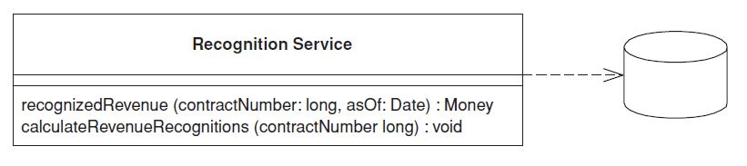

- Domain Model
    > An object model of the domain that incorporates both behavior and data.
     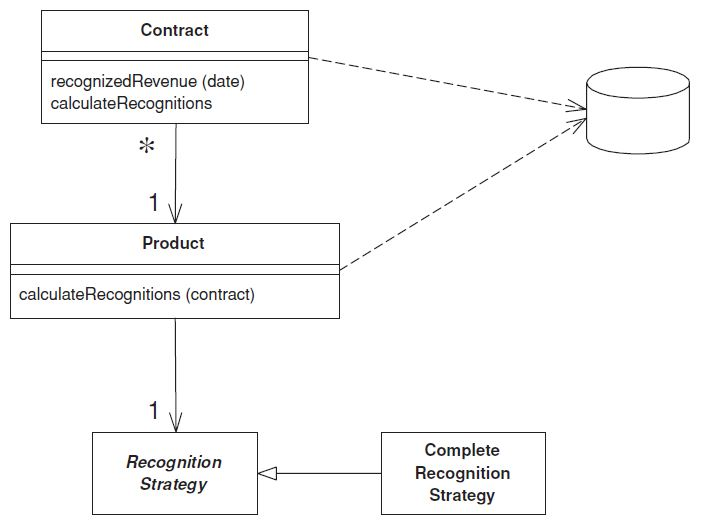

- Table Module
    > A single instance that handles the business logic for all rows in a database table or view.
     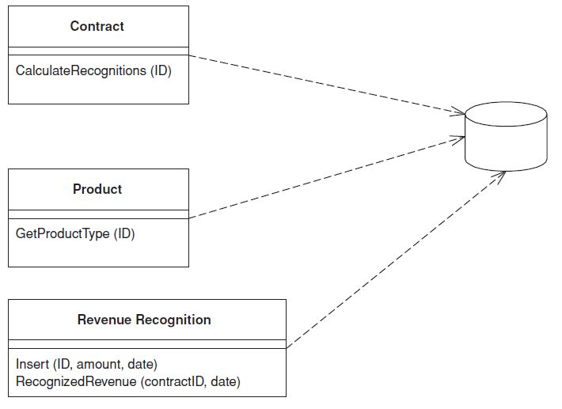

- Service Layer
    > Defines an application’s boundary with a layer of services that establishes a set of available operations and coordinates the application’s response in each operation.
     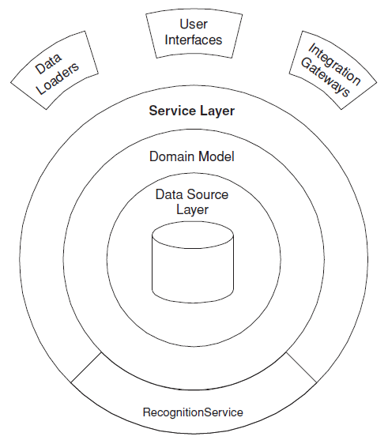

<a name="DataSourcePatterns"/>

**Data Source Patterns**
- Table Data Gateway
    > An object that acts as a Gateway to a database table. One instance handles all the rows in the table.
     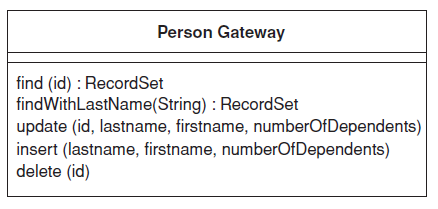

- Row Data Gateway
    > An object that acts as a Gateway to a single record in a data source. There is one instance per row.
     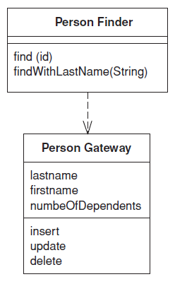

- Active Records
    > An object that wraps a row in a database table or view, encapsulates the database access, and adds domain logic on that data.
     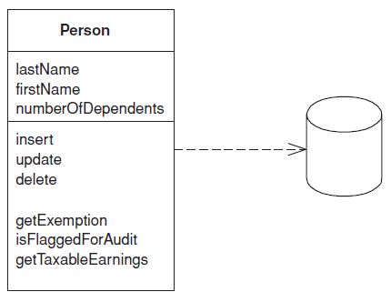

- Data Mapper
    > A layer of Mappers (473) that moves data between objects and a database while keeping them independent of each other and the mapper itself.
     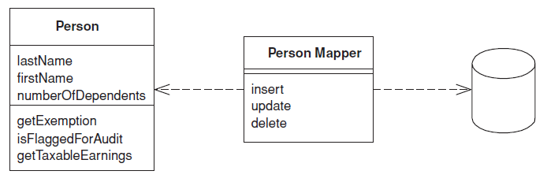

<a name="ObjectRelationalBehaviorPatterns"/>

**Object-Relational Behavior Patterns**
- Unit of Work
    > Maintains a list of objects affected by a business transaction and coordinates the writing out of changes and the resolution of concurrency problems.
     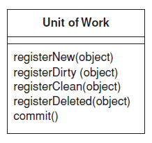

- Identify Map
    > Ensures that each object gets loaded only once by keeping every loaded object in a map. Looks up objects using the map when referring to them.
     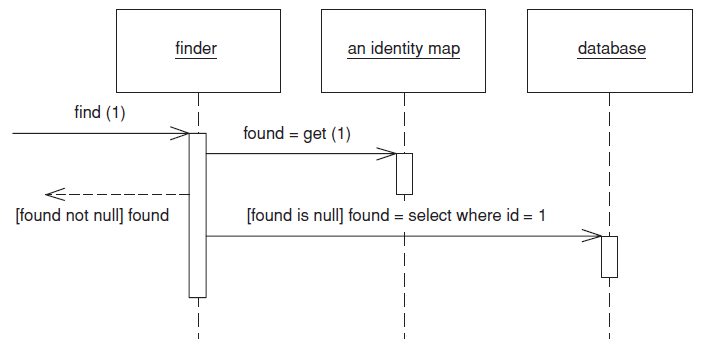

- Lazy Load
    > An object that doesn't contain all of the data you need but knows how to get it.
     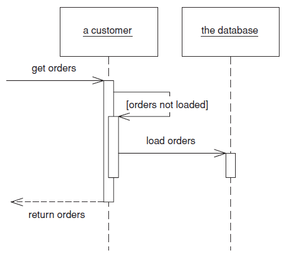

    - Types:
        - Lazy Initialization
        - Virtual Proxy
        - Value Holder
        - Ghost

<a name="ObjectRelationalStructuralPatterns"/>

**Object-Relational Structural Patterns**
- Identity Field
    > Saves a database ID field in an object to maintain identity between an in-memory object and a database row.
     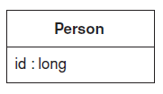

    - Types:
        - Integral
        - Key Table
        - Compound Key

- Foreign Key Mapping
    > Maps an association between objects to a foreign key reference between tables.
     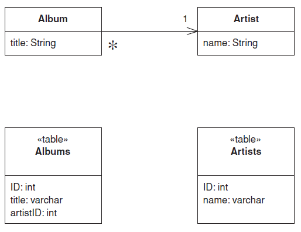
    - Types:
        - Single-Valued Reference
        - Multi Table Find
        - Collection of References

- Association Table Mapping
    > Saves an association as a table with foreign keys to the tables that are linked by the association.
     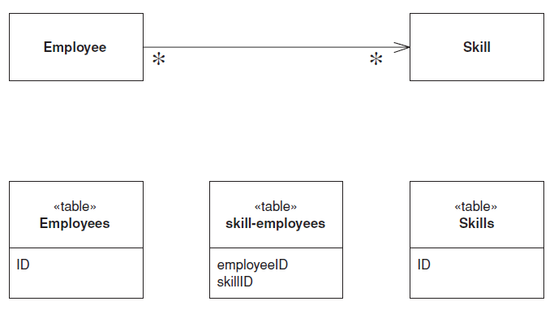

- Dependent Mapping
    > Has one class perform the database mapping for a child class.
     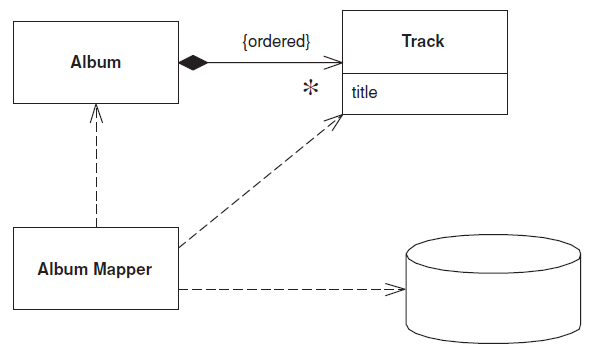

- Embedded Value
    > Maps an object into several fields of another object’s table.
     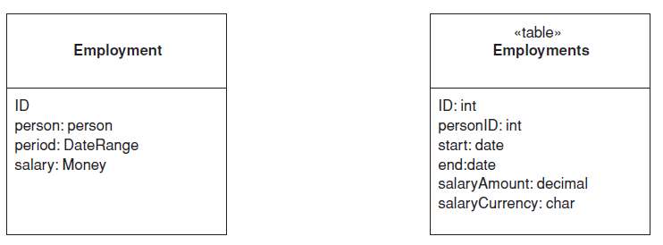

- Serialized LOB
    > Saves a graph of objects by serializing them into a single large object (LOB), which it stores in a database field.
     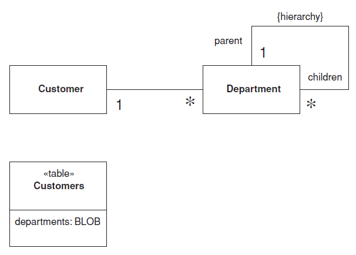

- Single Table Inheritance
    > Represents an inheritance hierarchy of classes as a single table that has columns for all the fields of the various classes.
     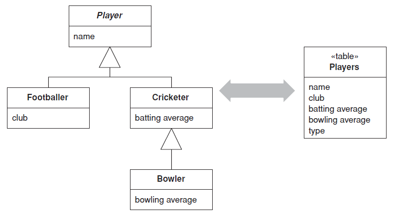

- Class Table Inheritance
    > Represents an inheritance hierarchy of classes with one table for each class.
     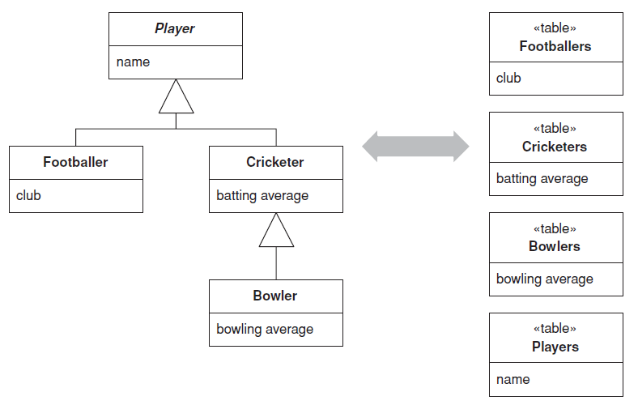

- Concrete Table Inheritance
    > Represents an inheritance hierarchy of classes with one table per concrete class in the hierarchy.
     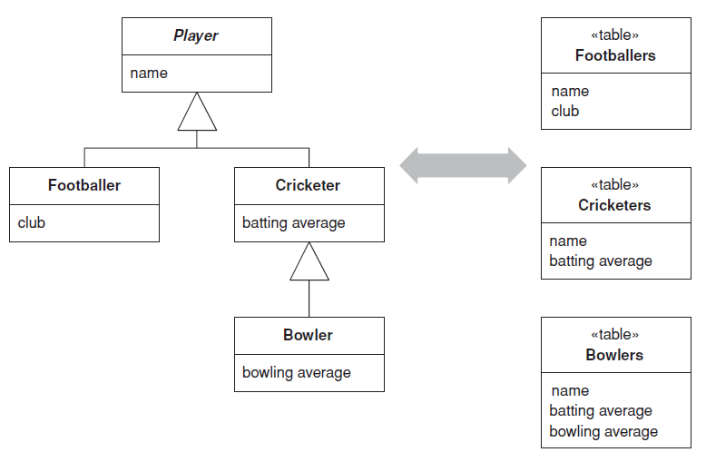

- Inheritance Mappers
    > A structure to organize database mappers that handle inheritance hierarchies.
     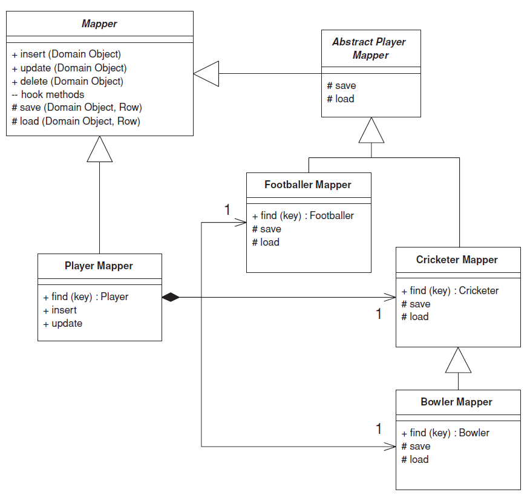

<a name="ObjectRelationalMetadataMappingPatterns"/>

**Object-Relational Metadata Mapping Patterns**
- Metadata Mapping
    > Holds details of object-relational mapping in metadata.
     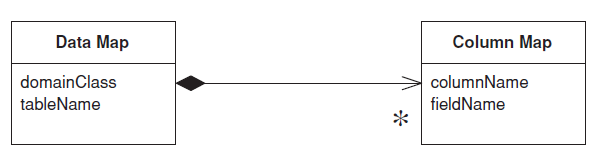

- Query Object
    > An object that represents a database query.
     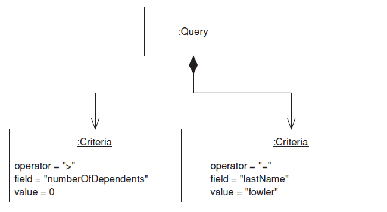

- Repository
    > Mediates between the domain and data mapping layers using a collection-like interface for accessing domain objects.
     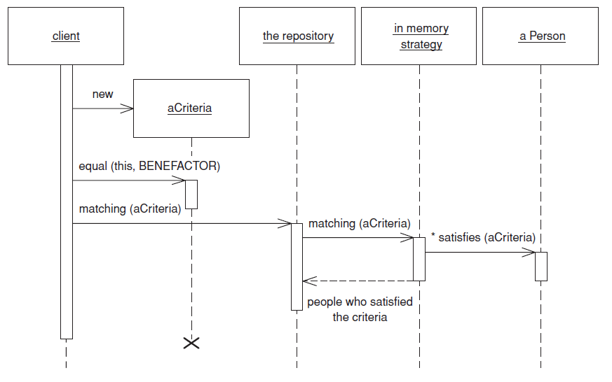

<a name="WebPresentationPatterns"/>

**Web Presentation Patterns**
- Model View Controller
    > Splits user interface interaction into three distinct roles.
     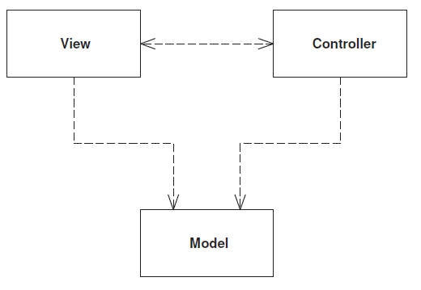

- Page Controller
    > An object that handles a request for a specific page or action on a Web site.
     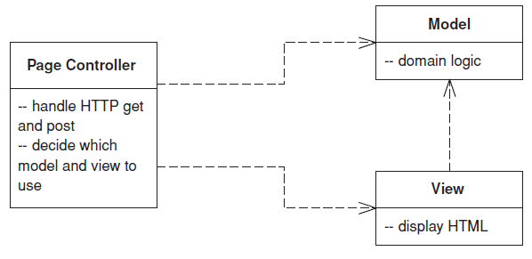

- Front Controller
    > A controller that handles all requests for a Web site.
     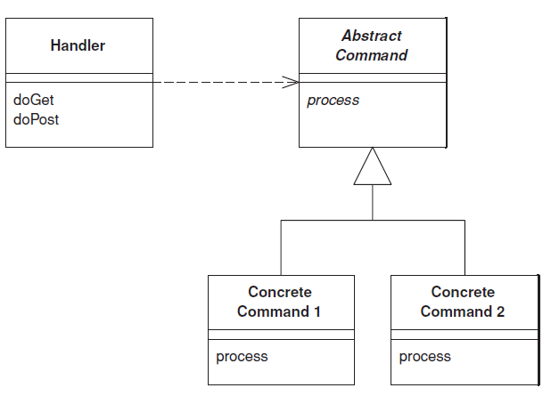

- Template View
    > Renders information into HTML by embedding markers in an HTML page.
     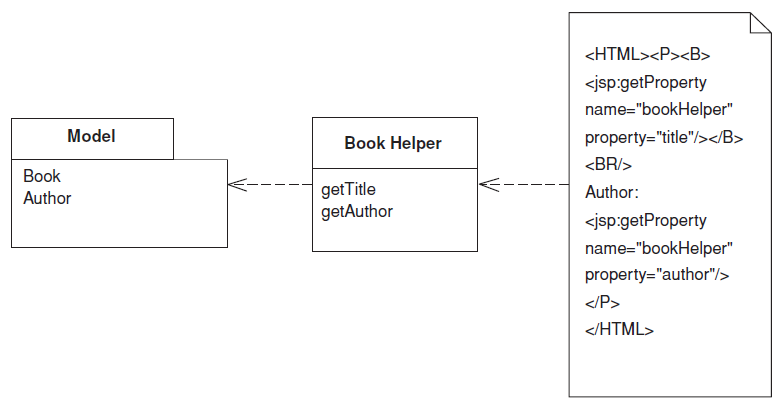

- Transform View
    > A view that processes domain data element by element and transforms it into HTML.
     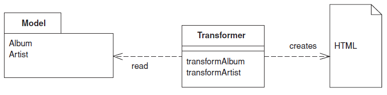

- Two Step View
    > Turns domain data into HTML in two steps: first by forming some kind of logical page, then rendering the logical page into HTML.
     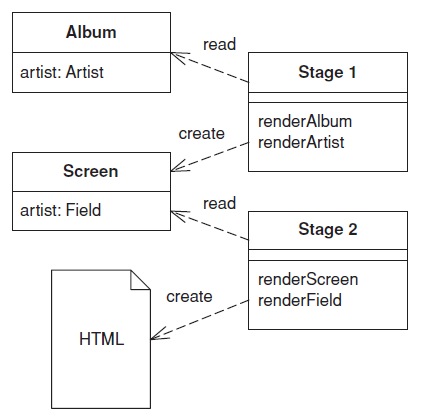

- Application Controller
    > A centralized point for handling screen navigation and the flow of an application.
     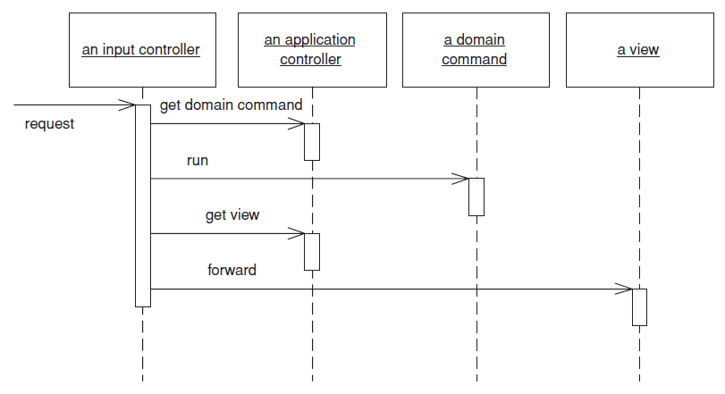

<a name="DistributionPatterns"/>

**Distribution Patterns**
- Remote Facade
    > Provides a coarse-grained facade on fine-grained objects to improve efficiency over a network.
     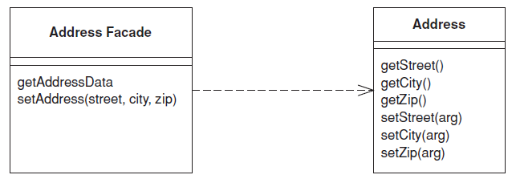

- Data Transfer Object
    > An object that carries data between processes in order to reduce the number of method calls.
     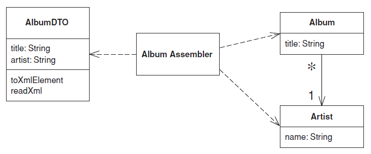

<a name="OfflineConcurrencyPatterns"/>

**Offline Concurrency Patterns**
- Optimistic Offline Lock
    > Prevents conflicts between concurrent business transactions by detecting a conflict and rolling back the transaction.
     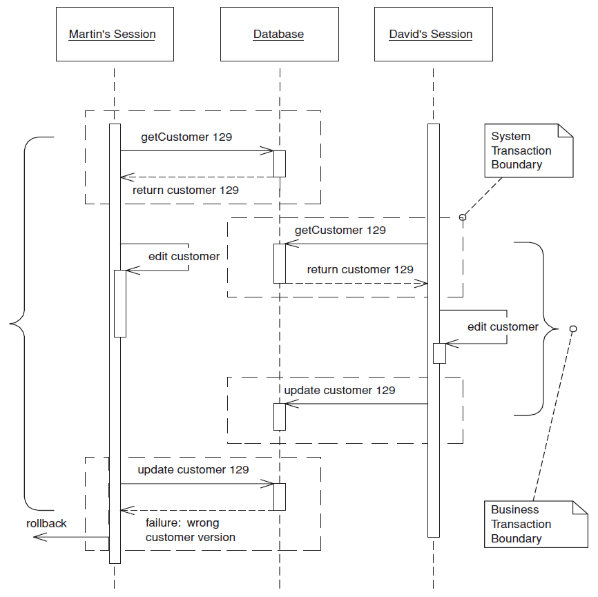

- Pessimistic Offline Lock
    > Prevents conflicts between concurrent business transactions by allowing only one business transaction at a time to access data.
     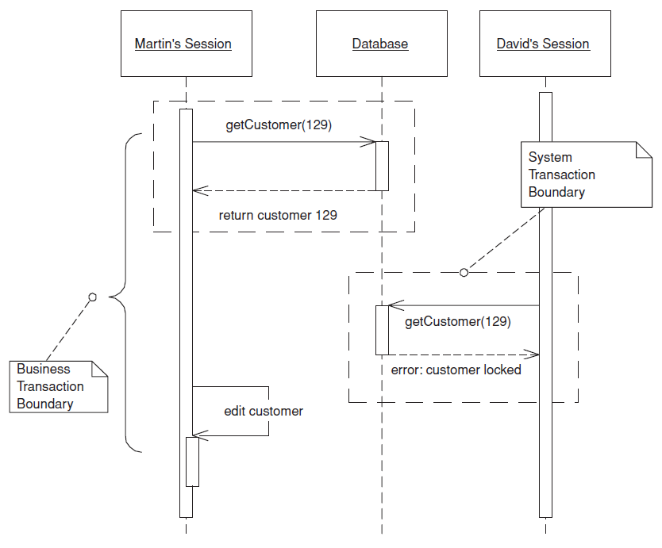

- Coarse-Grained Lock
    > Locks a set of related objects with a single lock.
     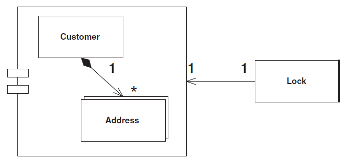

- Implicit Lock
    > Allows framework or layer supertype code to acquire offline locks.
     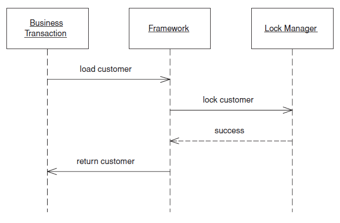

**Session State Patterns**
- Client Session State
    > Stores session state on the client.

- Server Session State
    > Keeps the session state on a server system in a serialized form.

- Database Session State
    > Stores session data as committed data in the database.

<a name="BasePatterns"/>

**Base Patterns**
- Gateway
    > An object that encapsulates access to an external system or resource.
     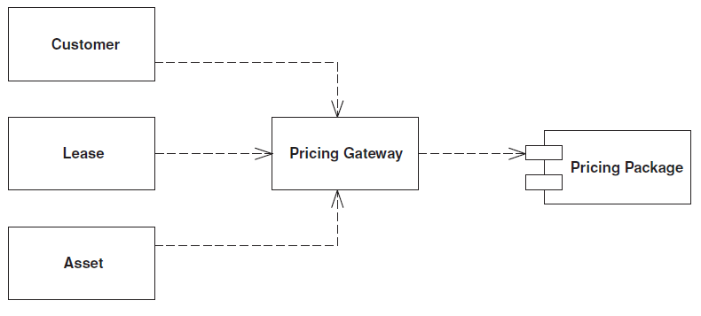

- Mapper
    > An object that sets up a communication between two independent objects.
     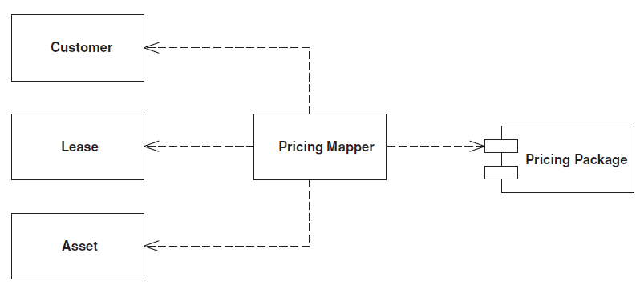

- Layer Supertype
    > A type that acts as the supertype for all types in its layer.

- Separated Interface
    > Defines an interface in a separate package from its implementation.
     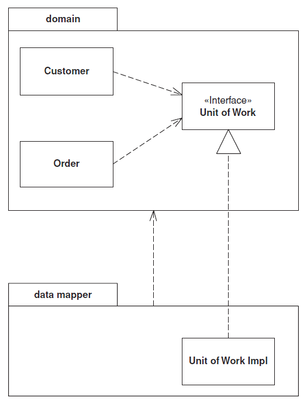

- Registry
    > A well-known object that other objects can use to find common objects and services.
     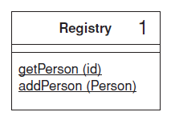

- Value Object
    > A small simple object, like money or a date range, whose equality isn’t based on identity.

- Money
    > Represents a monetary value.
     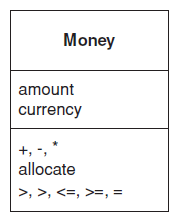

- Special Case
    > A subclass that provides special behavior for particular cases.
     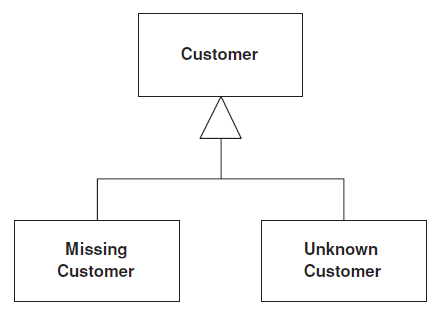

- Plugin
    > Links classes during configuration rather than compilation.
     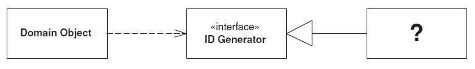

- Service Stub
    > Removes dependence upon problematic services during testing.
     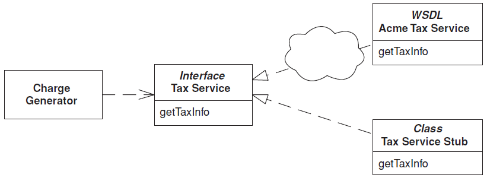

- Record Set
    > An in-memory representation of tabular data.
     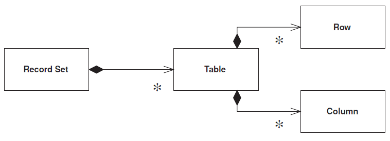

## Additional References
- https://martinfowler.com/eaaCatalog/
- https://www.sourcecodeexamples.net/p/p-of-eaa.html
- Lazy Load: Ghost
    - https://stackoverflow.com/questions/58243839/how-to-implement-lazy-loading-using-ghost-object-in-java
